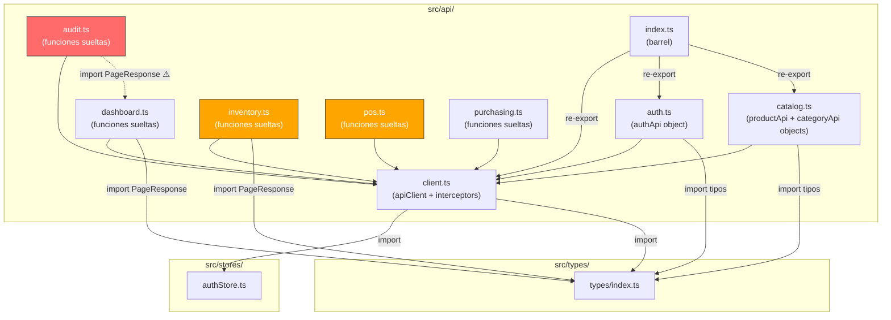

# Parte 2 — Análisis de la Capa de API

Análisis profundo de `src/api/` — el cliente HTTP, interceptores, y todos los módulos de endpoints.

## Archivos Analizados

| Archivo | Líneas | Patrón de Export | Unwrap `response.data`? |
|---|---|---|---|
| [client.ts](file:///d:/Escritorio/trabajo/UCC/cuarto/FrontendVeltro/src/api/client.ts) | 116 | Named export (`apiClient`) | N/A (infraestructura) |
| [auth.ts](file:///d:/Escritorio/trabajo/UCC/cuarto/FrontendVeltro/src/api/auth.ts) | 50 | Objeto namespace (`authApi`) | ✅ Sí |
| [catalog.ts](file:///d:/Escritorio/trabajo/UCC/cuarto/FrontendVeltro/src/api/catalog.ts) | 86 | Objeto namespace (`productApi`, `categoryApi`) | ✅ Sí |
| [inventory.ts](file:///d:/Escritorio/trabajo/UCC/cuarto/FrontendVeltro/src/api/inventory.ts) | 201 | Funciones sueltas | ❌ No |
| [pos.ts](file:///d:/Escritorio/trabajo/UCC/cuarto/FrontendVeltro/src/api/pos.ts) | 176 | Funciones sueltas (mixto) | ❌ No (mayoría) |
| [purchasing.ts](file:///d:/Escritorio/trabajo/UCC/cuarto/FrontendVeltro/src/api/purchasing.ts) | 235 | Funciones sueltas | ❌ No |
| [dashboard.ts](file:///d:/Escritorio/trabajo/UCC/cuarto/FrontendVeltro/src/api/dashboard.ts) | 77 | Funciones sueltas | ❌ No |
| [audit.ts](file:///d:/Escritorio/trabajo/UCC/cuarto/FrontendVeltro/src/api/audit.ts) | 65 | Funciones sueltas | ❌ No |
| [index.ts](file:///d:/Escritorio/trabajo/UCC/cuarto/FrontendVeltro/src/api/index.ts) | 4 | Barrel re-export | N/A |

---

## Diagrama de Dependencias de la Capa API



---

## Hallazgos y Propuestas de Optimización

---

### Hallazgo 1 — Dos patrones de export incompatibles coexisten

**Estado actual:** La capa API tiene dos estilos de organización completamente diferentes:

| Estilo | Archivos | Ejemplo |
|---|---|---|
| **Objeto namespace** | `auth.ts`, `catalog.ts` | `authApi.login()`, `productApi.getAll()` |
| **Funciones sueltas** | `inventory.ts`, `pos.ts`, `purchasing.ts`, `dashboard.ts`, `audit.ts` | `getInventory()`, `confirmSale()` |

Esto crea inconsistencia en cómo los consumidores importan y usan la API:

```tsx
// En una página que usa auth (namespace):
import { authApi } from '../../api/auth';
await authApi.login(data);

// En una página que usa inventory (funciones sueltas):
import { getInventory, recordStockEntry, updateStockLimits } from '../../api/inventory';
await getInventory(0, 20);
```

**Propuesta:** Unificar al patrón **objeto namespace** en todos los archivos. Es el patrón más limpio porque:
- Agrupa funciones relacionadas bajo un nombre claro (`inventoryApi.getAll()` vs `getInventory()`)
- Reduce colisiones de nombres (ej. varios módulos podrían tener un `getAll`)
- Un solo import por módulo en los consumidores
- Ya funciona en `auth.ts` y `catalog.ts`, así que sería extender lo que ya existe

**Impacto:** Consistencia en toda la capa, imports más limpios en páginas y hooks.

---

### Hallazgo 2 — Retorno inconsistente: `response.data` vs `AxiosResponse` crudo

**Estado actual:** Este es el problema más peligroso de la capa API. Dependiendo del archivo, la función retorna cosas diferentes:

```tsx
// auth.ts — retorna response.data (el JSON limpio)
login: async (credentials) => {
  const response = await apiClient.post('/auth/login', credentials);
  return response.data;  // ← unwrapped
}

// inventory.ts — retorna el AxiosResponse completo
export const getInventory = (page, size) => {
  return apiClient.get('/inventory', { params: { page, size } });
  // ← el consumidor recibe { data, status, headers, config... }
}
```

Esto significa que **los consumidores deben saber qué patrón usa cada archivo**:

```tsx
// Consumiendo auth (ya unwrapped):
const loginData = await authApi.login(creds);  // ← tipo directo

// Consumiendo inventory (raw response):
const response = await getInventory(0, 20);
const inventoryData = response.data;  // ← necesita .data
```

**Archivos que hacen unwrap:** `auth.ts`, `catalog.ts` (parcial — `productApi.create/update/getAll/getById/getByBarcode` sí, `delete/activate` no), `pos.ts` solo `searchProducts`.

**Archivos que NO hacen unwrap:** `inventory.ts`, `purchasing.ts`, `dashboard.ts`, `audit.ts`, la mayoría de `pos.ts`.

**Propuesta:** Unificar a **siempre retornar `response.data`**. Ningún consumidor de la capa API necesita acceder a `response.status` o `response.headers` (los errores HTTP ya los maneja el interceptor del client). Retornar siempre el dato limpio simplifica el consumo.

**Impacto:** Alto. Elimina una fuente constante de bugs sutiles donde un desarrollador asume un patrón y usa el otro.

> [!WARNING]
> Este cambio requiere actualizar **todos los consumidores** que actualmente hacen `.data` sobre el resultado de las funciones de `inventory.ts`, `purchasing.ts`, `dashboard.ts`, `audit.ts`, y `pos.ts`. Es un cambio amplio pero mecánico.

---

### Hallazgo 3 — Tipo `Product` duplicado: `pos.ts` debe adoptar `types/index.ts`

**Estado actual:** Hay dos interfaces `Product` completamente diferentes:

En [types/index.ts:69-85](file:///d:/Escritorio/trabajo/UCC/cuarto/FrontendVeltro/src/types/index.ts#L69-L85) — ✅ **CORRECTO** (refleja el backend real):
```tsx
export interface Product {
  id: number;
  name: string;
  barcode: string | null;      // nullable — Java String sin @NonNull
  sku: string | null;           // nullable
  description: string | null;   // nullable
  costPrice: string;
  salePrice: string;
  categoryId: number | null;    // nullable — Java Long puede ser null
  categoryName: string | null;  // nullable
  // ... más campos, incluyendo createdAt, updatedAt
  active: boolean;
}
```

En [pos.ts:39-54](file:///d:/Escritorio/trabajo/UCC/cuarto/FrontendVeltro/src/api/pos.ts#L39-L54) — ❌ **INCORRECTO**:
```tsx
export interface Product {
  id: number;
  name: string;
  barcode: string;             // ❌ PELIGROSO — backend puede enviar null
  sku: string;                  // ❌ PELIGROSO — backend puede enviar null
  description?: string;        // ❌ optional ≠ null
  costPrice: string;
  salePrice: string;
  categoryId: number;           // ❌ PELIGROSO — backend puede enviar null
  categoryName: string;         // ❌ PELIGROSO — backend puede enviar null
  currentStock?: number;        // ❌ NO existe en ProductResponse del backend
  active: boolean;
}
```

> [!CAUTION]
> **Confirmado con el backend:** `ProductResponse.java` usa tipos Java `String` y `Long` sin anotaciones `@NonNull`. Todos esos campos **pueden ser `null` en runtime**. `types/index.ts` lo refleja correctamente. `pos.ts` miente al TypeScript diciendo que son non-nullable.

**Problema con `currentStock`:** Este campo **no existe** en la respuesta de `GET /products`. No viene del `ProductResponse` del backend. Si algún consumidor lo usa, está leyendo `undefined` en runtime. El stock real viene de `GET /inventory/{productId}`, un endpoint completamente diferente.

**Propuesta concreta:**
1. **Eliminar** la interfaz `Product` de `pos.ts`.
2. **Importar** `Product` desde `../types` en todos los consumidores de `pos.ts`.
3. **Eliminar** `currentStock` — si el POS necesita stock, debe obtenerlo de la API de inventario, no inventar un campo en el tipo de producto.

```tsx
// En pos.ts — eliminada la interfaz Product local
import type { Product } from '../types';
// currentStock eliminado: no viene de GET /products
```

**Impacto:** Elimina una duplicación peligrosa con tipos incorrectos que pueden causar crashes en runtime (`null.toLowerCase()` etc.).

#### Prerrequisito para H3 — Grep de consumidores de `Product` de `pos.ts`

Antes de eliminar la interfaz `Product` de `pos.ts`, hay que identificar qué archivos la importan.

**Comandos de búsqueda:**

```bash
# 1. Buscar todos los imports de Product que vengan de api/pos
grep -rn "Product" src/ --include="*.ts" --include="*.tsx" | grep "api/pos"

# 2. Buscar usos de currentStock en todo el proyecto
grep -rn "currentStock" src/ --include="*.ts" --include="*.tsx"
```

**Resultado esperado:** ~2-3 archivos consumidores (componentes del POS, cart store, o páginas de inventario).

**Por cada archivo encontrado:**
- Cambiar el import para traer `Product` desde `'../types'` (o `'../../types'` según la profundidad)
- Si el archivo usa `currentStock`: eliminar ese uso o reemplazar con llamada a `getInventoryByProductId()` de la API de inventario

Output esperado:

| Archivo consumidor | Import actual | Usa `currentStock`? | Cambio requerido |
|---|---|---|---|
| `src/components/pos/...` | `import { Product } from '../../api/pos'` | Sí/No | Cambiar import a `../../types` + eliminar currentStock si aplica |

---

### Hallazgo 4 — `categoryApi.getAll()` y `categoryApi.getTree()` son idénticos

**Estado actual en** [catalog.ts:57-65](file:///d:/Escritorio/trabajo/UCC/cuarto/FrontendVeltro/src/api/catalog.ts#L57-L65):

```tsx
getAll: async (): Promise<Category[]> => {
  const response = await apiClient.get<Category[]>('/categories');
  return response.data;
},

getTree: async (): Promise<Category[]> => {
  const response = await apiClient.get<Category[]>('/categories');
  return response.data;
},
```

Son **exactamente la misma función**: mismo endpoint, mismos parámetros, mismo tipo de retorno. Código duplicado literal.

**Propuesta:** Eliminar `getTree` y que los consumidores usen `getAll`. Si en el futuro el backend agrega un endpoint `/categories/tree` con una respuesta diferente, se recrea en ese momento.

**Impacto:** Bajo en líneas, alto en claridad — elimina confusión sobre cuál usar.

> [!NOTE]
> Antes de eliminar `getTree`, hay que buscar todos sus consumidores con grep para reemplazarlos por `getAll`.

---

### Hallazgo 5 — Código muerto: 3 funciones que siempre fallan o no aportan nada

**Este hallazgo agrupa 3 piezas de código muerto/inútil** que se limpian en un solo paso:

#### 5a. `authApi.getCurrentUser()` — siempre lanza error

**En** [auth.ts:39-44](file:///d:/Escritorio/trabajo/UCC/cuarto/FrontendVeltro/src/api/auth.ts#L39-L44):

```tsx
getCurrentUser: async (): Promise<User> => {
  throw new Error('GET /auth/me is not implemented on the backend.');
},
```

Su propio comentario dice _"should not be called"_. Si algún consumidor la llama, ya está roto.

#### 5b. `exportAuditCsv()` — siempre lanza error

**En** [audit.ts:62-64](file:///d:/Escritorio/trabajo/UCC/cuarto/FrontendVeltro/src/api/audit.ts#L62-L64):

```tsx
export const exportAuditCsv = async (_filters: AuditFilters = {}) => {
  throw new Error('Audit CSV export is not yet implemented on the backend.');
};
```

Mismo patrón que `getCurrentUser`: función que solo existe para lanzar error. Código muerto.

#### 5c. `PurchaseOrderResponse extends PurchaseOrder {}` — interface vacía

**En** [purchasing.ts:97](file:///d:/Escritorio/trabajo/UCC/cuarto/FrontendVeltro/src/api/purchasing.ts#L97):

```tsx
export interface PurchaseOrderResponse extends PurchaseOrder {}
```

Interface vacía que solo es un alias de `PurchaseOrder`. No agrega campos, no agrega comportamiento. Solo agrega indirección sin valor.

**Criterio de búsqueda y reemplazo para H5c:**

```bash
# Paso 1: Buscar TODAS las referencias (directas, alias, re-exports)
grep -rn "PurchaseOrderResponse" src/ --include="*.ts" --include="*.tsx"
grep -rn "as PurchaseOrderResponse" src/ --include="*.ts" --include="*.tsx"
grep -rn "export.*PurchaseOrderResponse" src/ --include="*.ts" --include="*.tsx"
```

**Resultado esperado:** ~1-2 archivos consumidores (probablemente solo `purchasing.ts` y quizás algún componente de órdenes de compra).

```
Paso 2: Por cada archivo encontrado, clasificar el uso:
   - Tipo de retorno de función  → REEMPLAZAR por PurchaseOrder
   - Tipo de variable/const      → REEMPLAZAR por PurchaseOrder
   - Import statement            → CAMBIAR a importar PurchaseOrder
   - Alias (as PurchaseOrderResponse) → ELIMINAR alias, usar PurchaseOrder
   - Re-export (export type { PurchaseOrderResponse }) → ELIMINAR o cambiar a PurchaseOrder
   - La propia definición (purchasing.ts:97)  → ELIMINAR la línea

Paso 3: Verificar que no queden referencias con:
   grep -rn "PurchaseOrderResponse" src/  → debe retornar 0 resultados
```

> [!NOTE]
> No hacer find-and-replace ciego. Verificar cada uso individualmente porque `PurchaseOrderResponse` podría aparecer en strings, comentarios, o con alias que no deben cambiar automáticamente.

**Propuesta:** Eliminar las 3 piezas (5a + 5b + 5c) en un solo paso.

**Impacto:** Limpieza de código muerto e indirección innecesaria.

---

### Hallazgo 6 — `audit.ts` importa `PageResponse` de `dashboard.ts` en vez de `types/`

**Estado actual en** [audit.ts:2](file:///d:/Escritorio/trabajo/UCC/cuarto/FrontendVeltro/src/api/audit.ts#L2):

```tsx
import type { PageResponse } from './dashboard';
```

Mientras que `inventory.ts` y `dashboard.ts` importan de `../types`:

```tsx
// inventory.ts:2
import type { PageResponse } from '../types';

// dashboard.ts:2
import type { PageResponse } from '../types';
```

`audit.ts` crea una **dependencia lateral innecesaria** entre archivos del mismo nivel. Si `dashboard.ts` se refactorizara o se eliminara el re-export, `audit.ts` se rompería sin razón.

**Propuesta:** Cambiar el import de `audit.ts` a:

```tsx
import type { PageResponse } from '../types';
```

**Impacto:** Trivial. Elimina acoplamiento frágil entre módulos hermanos.

---

### Hallazgo 7 — `index.ts` (barrel) incompleto: solo exporta 3 de 7 módulos

**Estado actual en** [index.ts](file:///d:/Escritorio/trabajo/UCC/cuarto/FrontendVeltro/src/api/index.ts):

```tsx
export { apiClient } from './client';
export { authApi } from './auth';
export { productApi, categoryApi } from './catalog';
```

**No exporta:** `inventory`, `pos`, `purchasing`, `dashboard`, `audit`.

Esto causa que los consumidores importen directamente del archivo específico en vez de usar el barrel:

```tsx
// Consumidor importa directo (bypass barrel)
import { getInventory } from '../../api/inventory';
import { confirmSale } from '../../api/pos';
```

**Propuesta:** Hay dos opciones:
1. **Completar el barrel** — agregar los exports faltantes. Pero esto solo tiene sentido si primero se unifica al patrón namespace (Hallazgo 1), porque exportar 20+ funciones sueltas en un barrel es desordenado.
2. **Eliminar el barrel** — si cada módulo se importa directamente, el barrel es innecesario.

**Recomendación:** Completar el barrel **después** de unificar al patrón namespace (Hallazgo 1). Así el barrel exportaría: `apiClient`, `authApi`, `catalogApi`, `inventoryApi`, `posApi`, `purchasingApi`, `dashboardApi`, `auditApi`.

**Impacto:** Mejor descubrimiento de la API disponible, imports centralizados.

---

### Hallazgo 8 — Lógica de fechas duplicada en `dashboard.ts`

**Estado actual en** [dashboard.ts:42-56](file:///d:/Escritorio/trabajo/UCC/cuarto/FrontendVeltro/src/api/dashboard.ts#L42-L56) y [dashboard.ts:62-76](file:///d:/Escritorio/trabajo/UCC/cuarto/FrontendVeltro/src/api/dashboard.ts#L62-L76):

```tsx
// exportProfitabilityReportPdf
export const exportProfitabilityReportPdf = () => {
  const end = new Date();
  const start = new Date();
  start.setDate(1);
  const startDateStr = start.toISOString().split('T')[0];
  const endDateStr = end.toISOString().split('T')[0];
  return apiClient.get<Blob>(`/reports/export/PDF?startDate=${startDateStr}&endDate=${endDateStr}`, { responseType: 'blob' });
};

// exportProfitabilityReportExcel — EXACTAMENTE la misma lógica de fechas
export const exportProfitabilityReportExcel = () => {
  const end = new Date();
  const start = new Date();
  start.setDate(1);
  const startDateStr = start.toISOString().split('T')[0];
  const endDateStr = end.toISOString().split('T')[0];
  return apiClient.get<Blob>(`/reports/export/EXCEL?startDate=${startDateStr}&endDate=${endDateStr}`, { responseType: 'blob' });
};
```

El cálculo de fechas (primer día del mes hasta hoy) está **copiado y pegado**. Ambas funciones solo difieren en `PDF` vs `EXCEL` en la URL.

**Propuesta:** Extraer una función interna que parametrice el formato:

```tsx
const exportReport = (format: 'PDF' | 'EXCEL') => {
  const end = new Date();
  const start = new Date();
  start.setDate(1);
  const startDateStr = start.toISOString().split('T')[0];
  const endDateStr = end.toISOString().split('T')[0];
  return apiClient.get<Blob>(
    `/reports/export/${format}?startDate=${startDateStr}&endDate=${endDateStr}`,
    { responseType: 'blob' }
  );
};

export const exportProfitabilityReportPdf = () => exportReport('PDF');
export const exportProfitabilityReportExcel = () => exportReport('EXCEL');
```

**Impacto:** Bajo en líneas, alto en mantenibilidad — si la lógica de fechas cambia, se modifica en un solo lugar.

---

## Hallazgos Menores (No requieren plan, pero son notables)

| Observación | Archivo | Línea | Detalle |
|---|---|---|---|
| `aiDetectFrame` retorna `any` — **tipar con `DetectSearchResponse`** | [pos.ts](file:///d:/Escritorio/trabajo/UCC/cuarto/FrontendVeltro/src/api/pos.ts#L159) | 159 | Contrato del backend ya confirmado (ver sección abajo). |
| Refresh URL hardcodeada | [client.ts](file:///d:/Escritorio/trabajo/UCC/cuarto/FrontendVeltro/src/api/client.ts#L89) | 89 | Usa `'/api/v1/auth/refresh'` literal en vez de `${API_BASE_URL}/auth/refresh`. Si `VITE_API_BASE_URL` cambia, el refresh se rompe. |
| `searchProducts` tiene filtrado client-side fallback | [pos.ts](file:///d:/Escritorio/trabajo/UCC/cuarto/FrontendVeltro/src/api/pos.ts#L106-L113) | 106-113 | Código defensivo que duplica lógica del backend. Funciona, pero añade complejidad. |
| `inventory.ts` re-exporta `PageResponse` | [inventory.ts](file:///d:/Escritorio/trabajo/UCC/cuarto/FrontendVeltro/src/api/inventory.ts#L4) | 4 | `export type { PageResponse }` — innecesario si los consumidores importan de `types/`. |
| ~~`PurchaseOrderResponse extends PurchaseOrder {}` vacío~~ | [purchasing.ts](file:///d:/Escritorio/trabajo/UCC/cuarto/FrontendVeltro/src/api/purchasing.ts#L97) | 97 | **Promovido a H5c.** Interface vacía sin valor. |
| ~~`exportAuditCsv` siempre lanza error~~ | [audit.ts](file:///d:/Escritorio/trabajo/UCC/cuarto/FrontendVeltro/src/api/audit.ts#L62-L64) | 62-64 | **Promovido a H5b.** Código muerto. |
| Tipos locales masivos en `inventory.ts` y `purchasing.ts` | Ambos | — | Definen interfaces que deberían vivir en `types/`. Esto se analiza en la Parte 7. |

#### Tipado concreto para `aiDetectFrame` (contrato confirmado del backend)

El endpoint `POST /api/v1/scanner/detect` (`ScannerController` líneas 172-174) retorna un array con objetos que contienen `matches`. El tipo correcto:

```tsx
export interface DetectMatch {
  id: number;
  name: string;
  salePrice: string;
  barcode: string | null;
  sku: string | null;
}

export interface DetectSearchResponse {
  matches: DetectMatch[];
}

// En pos.ts — reemplazar `any`
export const aiDetectFrame = (imageBlob: Blob, filename: string) => {
  const formData = new FormData();
  formData.append('image', imageBlob, filename);
  return apiClient.post<DetectSearchResponse[]>('/scanner/detect', formData, {
    headers: { 'Content-Type': undefined },
    timeout: 15000,
  });
};
```

> [!NOTE]
> El contrato ya está confirmado. No hay razón para dejar `any` — la información del backend ya está disponible.

---

## Resumen de Propuestas

| # | Hallazgo | Prioridad | Esfuerzo | Requiere info del backend? |
|---|---|---|---|---|
| 1 | Unificar patrón export a namespace objects | 🔴 Alta | Alto | ❌ No |
| 2 | Unificar retorno a `response.data` siempre | 🔴 Alta | Alto | ❌ No |
| 2P | **Prerrequisito H2:** Mapeo de consumidores via grep | 🔴 Alta | Medio | ❌ No |
| 3 | Eliminar `Product` duplicado — `pos.ts` adopta `types/index.ts` | 🔴 Alta | Medio | ✅ Resuelto |
| 4 | Eliminar `categoryApi.getTree` duplicado | 🟢 Baja | Trivial | ❌ No |
| 5 | Eliminar código muerto (5a: `getCurrentUser`, 5b: `exportAuditCsv`, 5c: `PurchaseOrderResponse` vacío) | 🟢 Baja | Trivial | ❌ No |
| 6 | Fix import `PageResponse` en `audit.ts` | 🟢 Baja | Trivial | ❌ No |
| 7 | Completar barrel `index.ts` (después de H1) | 🟡 Media | Bajo | ❌ No |
| 8 | Deduplicar lógica de fechas en `dashboard.ts` | 🟢 Baja | Trivial | ❌ No |
| 9 | Tipar `aiDetectFrame` con `DetectSearchResponse` | 🟡 Media | Trivial | ✅ Resuelto |

---

## Información del Backend — Resuelta

> [!NOTE]
> **Toda la información del backend necesaria ha sido confirmada.** Ruta del backend: `D:\Escritorio\trabajo\UCC\cuarto\Veltro`

| Pregunta | Respuesta confirmada |
|---|---|
| ¿Campos nullable en `ProductResponse`? | `barcode`, `sku`, `description`, `categoryId`, `categoryName` — todos pueden ser `null` (Java `String`/`Long` sin `@NonNull`) |
| ¿`currentStock` viene en `GET /products`? | **No.** No existe en `ProductResponse.java`. El stock real viene de `GET /inventory/{productId}` |
| ¿Contrato de `POST /scanner/detect`? | Retorna `DetectSearchResponse[]` con `matches: DetectMatch[]` (confirmado en `ScannerController` L172-174) |

---

## Decisiones Confirmadas

| # | Pregunta | Decisión |
|---|---|---|
| 1 | ¿Qué interfaz `Product` adoptar? | `types/index.ts` es la correcta. `pos.ts` se elimina. `currentStock` se elimina. |
| 2 | ¿Ejecutar H1 y H2 juntos o separados? | **Separados.** Primero H2 (unwrap), después H1 (namespace). Una variable a la vez. |
| 3 | ¿Tipar `aiDetectFrame` o dejar `any`? | **Tipar.** Contrato confirmado: `DetectSearchResponse[]`. No hay razón para `any`. |
| 4 | ¿Mapeo de consumidores antes de H2? | **Sí, obligatorio.** Grep de todos los consumidores de las funciones afectadas antes de ejecutar H2. |
| 5 | ¿`PurchaseOrderResponse` vacío? | **Eliminar.** Promovido de hallazgo menor a H5c. Consumidores usan `PurchaseOrder` directamente. |

---

## Prerrequisito para H2 — Mapeo de Consumidores

> [!WARNING]
> **H2 (unificar retorno a `response.data`) NO puede ejecutarse sin este paso previo.** Es el cambio más riesgoso del plan porque afecta ~35+ funciones y todos sus consumidores.

### ¿Por qué es necesario?

Actualmente, las funciones de `inventory.ts`, `purchasing.ts`, `dashboard.ts`, `audit.ts` y la mayoría de `pos.ts` retornan el `AxiosResponse` crudo. Sus consumidores hacen `.data` sobre el resultado:

```tsx
// Consumidor actual (antes de H2)
const response = await getInventory(0, 20);
const items = response.data.content;  // ← accede a .data
```

Cuando H2 cambie las funciones a retornar `response.data` directamente, todos esos consumidores que hacen `.data` van a romper:

```tsx
// Después de H2 — esto se rompe
const response = await getInventory(0, 20);  // ahora retorna PageResponse directamente
const items = response.data.content;  // ❌ .data ya no existe, response ES el data
```

### Funciones a mapear (lista completa)

Estas son las funciones que actualmente retornan `AxiosResponse` crudo y necesitan unwrap:

**`inventory.ts` (14 funciones):**
- `getInventory`, `getInventoryByProductId`, `getInventoryMovements`
- `recordStockEntry`, `recordStockExit`, `recordStockAdjustment`
- `updateStockLimits`
- `getAlerts`, `markAlertAsRead`, `resolveAlert`, `dismissAlert`
- `getUnreadAlertCount`, `getAlertConfig`, `updateAlertConfig`

**`purchasing.ts` (~10 funciones):**
- `getSuppliers`, `createSupplier`, `updateSupplier`, `deleteSupplier`
- `createPurchaseOrder` ⚠️ (ver warning abajo)
- `getPurchaseOrders`, `getPurchaseOrderById`
- `clonePurchaseOrder`, `markAsReceived`, `voidPurchaseOrder`

> [!WARNING]
> **Caso especial: `createPurchaseOrder` (purchasing.ts L148-190)**
>
> Esta función ya hace unwrap parcial **internamente** porque orquesta un flujo multi-paso:
> ```tsx
> // Paso 1: crea la PO
> createResponse = await apiClient.post<PurchaseOrderResponse>('/purchase-orders', {...});
> const orderId = createResponse.data.id;  // ← unwrap interno, accede a .data
>
> // Paso 2: agrega items en loop
> const itemResponse = await apiClient.post<PurchaseOrderResponse>(`/purchase-orders/${orderId}/items`, {...});
> latestOrder = itemResponse.data;  // ← unwrap interno, accede a .data
> ```
>
> Durante H2, **solo se modifica el retorno público** (que la función retorne `response.data` al consumidor externo). Los `.data` internos sobre llamadas directas a `apiClient.post()` **NO se tocan** — esos acceden al `AxiosResponse` crudo que `apiClient` siempre retorna.
>
> **Regla:** Si la función ya llama a `apiClient` directamente (no a otra función de la capa API), el `.data` interno es correcto y necesario. Solo el retorno final hacia el consumidor cambia.

**`dashboard.ts` (3 funciones):**
- `getDashboard`
- `exportProfitabilityReportPdf`, `exportProfitabilityReportExcel`

**`audit.ts` (2 funciones tras eliminar `exportAuditCsv` en H5b):**
- `getAuditRecords`, `getAuditRecordDetail`

**`pos.ts` (6 funciones que NO hacen unwrap):**
- `getProductByBarcode`, `confirmSale`, `voidSale`
- `aiScanProduct`, `aiDetectFrame`, `checkAiAvailable`

> [!NOTE]
> `searchProducts` en `pos.ts` ya retorna `Promise<Product[]>` (hace unwrap internamente). **NO necesita cambios en H2.** Está excluida de esta lista.

### Qué buscar por cada función

```
Por cada función de la lista:

1. Grep del nombre exacto en src/ (excluyendo la propia definición):
   grep -rn "getInventory" src/ --include="*.ts" --include="*.tsx"

2. Por cada archivo encontrado, verificar:
   - ¿Hace .data sobre el resultado?  → QUITAR el .data
   - ¿NO hace .data?                  → NO CAMBIAR (ya consume correctamente)
   - ¿Desestructura { data }?          → CAMBIAR desestructuración por asignación directa

3. Documentar en la tabla de output
```

### Formato de output del mapeo

El resultado debe ser una tabla con exactamente estas 4 columnas:

| Función | Archivo consumidor | Línea | Cambio requerido |
|---|---|---|---|
| `getInventory` | `src/pages/inventory/InventoryPage.tsx` | 42 | Quitar `.data` — `response.data.content` → `response.content` |
| `getInventory` | `src/hooks/useInventory.ts` | 18 | Quitar desestructuración `{ data }` → asignación directa |
| `getDashboard` | `src/pages/dashboard/DashboardPage.tsx` | 31 | Quitar `.data` |
| `confirmSale` | `src/components/pos/SaleConfirm.tsx` | 55 | NO CAMBIAR — ya consume sin `.data` |

> [!IMPORTANT]
> Sin esta tabla completa, H2 no se ejecuta. Cada fila es un punto de cambio verificable. Después de H2, `npm run build` debe compilar sin errores.

### ¿Cuándo se ejecuta?

El mapeo se genera **después de H3 y antes de H2**, como parte del flujo:

```
H6 → H5 → H4 → H8 → H9 → H3 → [MAPEO] → H2 → H1 → H7
```

---

## Orden de Ejecución Confirmado


> [!TIP]
> Orden confirmado: triviales primero (H6→H5→H4→H8→H9), impacto medio (H3), **mapeo obligatorio**, luego los dos grandes **por separado** (H2 antes de H1). H7 cierra después de que todos los módulos estén unificados.

### Justificación del orden H2 → H1 (no al revés)

- **Si hicieras H1 primero** (namespace), las funciones aún retornarían `AxiosResponse` crudo. Luego al hacer H2 (unwrap), tendrías que cambiar la estructura (namespace) **y** el tipo de retorno en el mismo paso. Dos variables simultáneas.
- **Si hacés H2 primero** (unwrap), todas las funciones retornan `.data` directamente. Luego H1 (namespace) solo cambia cómo se agrupan, sin tocar tipos de retorno. Una variable a la vez.

### Estado destino: transición H2 → H1

Para que el agente no mezcle cambios entre H2 y H1, los estados intermedios están definidos:

#### Estado después de H2 (unwrap completado, namespace NO tocado aún)

```
✅ inventory.ts  → funciones SUELTAS + retornan response.data
✅ purchasing.ts → funciones SUELTAS + retornan response.data
✅ dashboard.ts  → funciones SUELTAS + retornan response.data
✅ audit.ts      → funciones SUELTAS + retornan response.data
✅ pos.ts        → funciones SUELTAS + retornan response.data
✅ auth.ts       → YA era namespace + YA retornaba response.data (sin cambios)
✅ catalog.ts    → YA era namespace + YA retornaba response.data (sin cambios)
✅ Consumidores  → TODOS actualizados, ya NO hacen .data sobre resultados
```

> En este estado intermedio: todos los retornos son consistentes (`.data`), pero la estructura de export sigue siendo mixta (namespace en auth/catalog, funciones sueltas en el resto).

#### Estado después de H1 (namespace completado)

```
✅ inventory.ts  → export const inventoryApi = { getAll, getByProductId, ... }
✅ purchasing.ts → export const purchasingApi = { getSuppliers, createPO, ... }
✅ dashboard.ts  → export const dashboardApi = { get, exportPdf, exportExcel }
✅ audit.ts      → export const auditApi = { getRecords, getDetail }
✅ pos.ts        → export const posApi = { getByBarcode, search, confirm, ... }
✅ auth.ts       → export const authApi = { ... } (ya estaba, sin cambios)
✅ catalog.ts    → export const productApi/categoryApi = { ... } (ya estaba, sin cambios)
✅ Consumidores  → Imports actualizados de funciones sueltas a namespace
                    getInventory(0,20) → inventoryApi.getAll(0,20)
```

> En este estado final: todos los módulos usan namespace objects, todos retornan `.data`, todos los consumidores usan `moduloApi.metodo()`.

#### Estado después de H7 (barrel completado)

```
✅ index.ts exporta: apiClient, authApi, productApi, categoryApi,
   inventoryApi, posApi, purchasingApi, dashboardApi, auditApi
✅ Consumidores PUEDEN importar desde 'api/' en vez de 'api/inventory'
```

---

## Plan de Verificación

### Build
- Ejecutar `npm run build` después de cada hallazgo grande (H2, H1) para confirmar que compila.
- Ejecutar `npm run build` después del mapeo + H2 para capturar cualquier `.data` que no se haya actualizado.

### Funcional
- Verificar que los consumidores de cada módulo API siguen funcionando tras el unwrap (H2).
- Verificar que los imports desde el barrel (H7) resuelven correctamente.

### Type Safety
- Confirmar que no quedan `any` en la capa API después de H9.
- Confirmar que `Product` solo existe en `types/index.ts` después de H3.
- Confirmar que `PurchaseOrderResponse` no se usa en ningún archivo después de H5c.

### Checkpoints de estado
- Después de H2: verificar que **ningún** archivo en `src/api/` retorna `AxiosResponse` crudo (solo `.data`).
- Después de H1: verificar que **ningún** archivo en `src/api/` exporta funciones sueltas (solo namespace objects).
- Después de H7: verificar que `src/api/index.ts` exporta los 7 módulos.

> [!TIP]
> **Este plan está 100% operacionalizado.** Cada hallazgo tiene criterios de búsqueda, formato de output, y estado destino definidos. Si aprobás, procedo con los triviales (H6→H5→H4→H8→H9).
