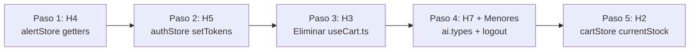

# Parte 3 — Plan de Ejecución: Limpieza de Estado Global (Stores)

Refactor quirúrgico de los 4 stores Zustand y hooks asociados. Elimina código muerto confirmado, corrige inconsistencias de tipos, y alinea la capa de estado con la arquitectura real del backend.

## Decisiones Resueltas

| Pregunta | Decisión |
|---|---|
| **H3 — ¿Eliminar o refactorizar `useCart`?** | **ELIMINAR completamente.** Grep confirma 0 consumidores. Todos los 12+ archivos usan `useCartStore` directo. |
| **H7 + Menores** | **Agrupar en un solo paso.** Ambos son consistencia de tipos en `ai.types.ts` + ajuste de logout. |

## Observación Backend (Fuera de Alcance)

> [!NOTE]
> `InsufficientStockException` está importada en [SaleService.java:24](file:///D:/Escritorio/trabajo/UCC/cuarto/Veltro/src/main/java/com/veltro/inventory/service/SaleService.java#L24) pero no se usa ahí — la excepción se lanza desde `InventoryService.recordExit()`. Es un import muerto en el backend. **No se toca en este plan** — es observación para un futuro refactor backend.

---

## Orden de Ejecución



> [!TIP]
> **Lógica del orden:** Triviales primero (H4, H5), luego eliminación de archivo (H3), después limpieza de tipos (H7+menores), y por último el cambio más impactante en lógica de negocio (H2).

---

## Paso 1 — H4: Eliminar getters muertos de `alertStore`

### [MODIFY] [alertStore.ts](file:///d:/Escritorio/trabajo/UCC/cuarto/FrontendVeltro/src/stores/alertStore.ts)

**Qué eliminar:**

1. **Interfaz `AlertStoreState`** — Eliminar las 2 líneas de declaración de tipo:
   - L13: `getUnreadAlerts: () => Alert[];`
   - L14: `getAlertsBySeverity: (severity: AlertSeverity) => Alert[];`

2. **Implementación** — Eliminar los 2 métodos completos:
   - L79-81: `getUnreadAlerts` (método + filtro)
   - L83-85: `getAlertsBySeverity` (método + filtro + parámetro)

3. **Import `AlertSeverity`** — Verificar si `AlertSeverity` sigue siendo necesario en el archivo después de eliminar `getAlertsBySeverity`. Si no se usa en otro lugar del store, eliminar del import en L2.

**Resultado esperado:** El store pierde 2 métodos no consumidos. ~8 líneas eliminadas.

**Verificación:**
```powershell
# Confirmar que no quedan referencias
rg "getUnreadAlerts|getAlertsBySeverity" src/
# Debe devolver 0 resultados
```

---

## Paso 2 — H5: Eliminar `setTokens` muerto de `authStore`

### [MODIFY] [authStore.ts](file:///d:/Escritorio/trabajo/UCC/cuarto/FrontendVeltro/src/stores/authStore.ts)

**Qué eliminar:**

1. **Interfaz `AuthState`** — Eliminar declaración de tipo:
   - L11: `setTokens: (auth: LoginResponse) => void;`

2. **Implementación** — Eliminar método completo:
   - L35-49: Todo el bloque `setTokens: (auth) => { ... },`

3. **Import `LoginResponse`** — Verificar si `LoginResponse` sigue siendo necesario después de eliminar `setTokens`. Si no se usa en otro lugar del store, eliminar del import en L3.

**Resultado esperado:** El store pierde 1 método no consumido. ~16 líneas eliminadas.

**Verificación:**
```powershell
# Confirmar que no quedan referencias a setTokens
rg "setTokens" src/
# Debe devolver 0 resultados

# Confirmar que LoginResponse se puede eliminar del import
rg "LoginResponse" src/stores/authStore.ts
# Si solo aparece en el import, eliminarlo
```

---

## Paso 3 — H3: Eliminar `useCart.ts` completamente

> [!IMPORTANT]
> **Decisión confirmada:** Grep demuestra 0 consumidores fuera de la definición y el barrel export. Todos los archivos de la aplicación usan `useCartStore` directamente.

### [DELETE] [useCart.ts](file:///d:/Escritorio/trabajo/UCC/cuarto/FrontendVeltro/src/hooks/useCart.ts)

Eliminar el archivo completo (52 líneas).

### [MODIFY] [index.ts](file:///d:/Escritorio/trabajo/UCC/cuarto/FrontendVeltro/src/hooks/index.ts)

**Qué eliminar:**

- L2: `export { useCart } from './useCart';`

**Estado final de `hooks/index.ts`:**
```typescript
export { useAuth } from './useAuth';
export { useAlerts } from './useAlerts';
export { useFocusTrap } from './useFocusTrap';
```

**Verificación:**
```powershell
# Confirmar que ningún archivo importa useCart del barrel o del archivo directo
rg "useCart[^S]" src/ --glob '!**/useCart.ts'
# Debe devolver 0 resultados (useCartStore sí aparecerá, eso es correcto)
```

---

## Paso 4 — H7 + Hallazgos Menores: Tipos AI + Limpieza de logout

Este paso agrupa 4 cambios relacionados con la consistencia del sistema de tipos AI:

### 4A — Mover `TrackedBox` a `ai.types.ts`

#### [MODIFY] [ai.types.ts](file:///d:/Escritorio/trabajo/UCC/cuarto/FrontendVeltro/src/modules/types/ai.types.ts)

**Agregar** al final del archivo (antes de `DEFAULT_AI_SCANNER_CONFIG`) la interfaz `TrackedBox` con su JSDoc:

```typescript
/**
 * Visual tracking entry produced by the IOU tracker in useYoloDetection.
 * trackId is stable across frames (not the same as YoloBox.id which is owned by setRawDetections).
 */
export interface TrackedBox {
  /** Persistent visual ID — NOT the same as YoloBox.id */
  trackId: string;
  /** Reference to the matched YOLO detection */
  box: YoloBox;
  /** performance.now() timestamp of last successful IOU match */
  lastSeen: number;
}
```

#### [MODIFY] [aiScanStore.ts](file:///d:/Escritorio/trabajo/UCC/cuarto/FrontendVeltro/src/stores/aiScanStore.ts)

- **Eliminar** la definición local de `TrackedBox` (L12-23, incluyendo JSDoc)
- **Agregar** `TrackedBox` al import existente de `ai.types.ts` en L10:
  ```typescript
  import type { ScanMode, AiUseCase, YoloBox, DetectionStatus, MatchedProduct, TrackedBox } from '../modules/types/ai.types';
  ```
- Mantener el `export` del tipo para consumidores — agregar un re-export:
  ```typescript
  export type { TrackedBox } from '../modules/types/ai.types';
  ```

#### [MODIFY] [useYoloDetection.ts](file:///d:/Escritorio/trabajo/UCC/cuarto/FrontendVeltro/src/hooks/useYoloDetection.ts)

- **Cambiar** el import de `TrackedBox` (L20):
  - **Antes:** `import type { TrackedBox } from '../stores/aiScanStore';`
  - **Después:** `import type { TrackedBox } from '../modules/types/ai.types';`

**Consumidores de `TrackedBox`:**
| Archivo | Import actual | Acción |
|---|---|---|
| `useYoloDetection.ts` | `from '../stores/aiScanStore'` | → Cambiar a `from '../modules/types/ai.types'` |
| `aiScanStore.ts` | Definición local | → Importar de `ai.types.ts` + re-exportar |

---

### 4B — Corregir `MatchedProduct` en `ai.types.ts`

#### [MODIFY] [ai.types.ts](file:///d:/Escritorio/trabajo/UCC/cuarto/FrontendVeltro/src/modules/types/ai.types.ts)

3 cambios en la interfaz `MatchedProduct` (L24-31):

| Campo | Antes | Después | Razón |
|---|---|---|---|
| `sku` (L27) | `sku: string` | `sku: string \| null` | El backend puede devolver `null` — consistencia con `types/index.ts` |
| `barcode` (L28) | `barcode: string` | `barcode: string \| null` | Mismo caso — consistencia con `types/index.ts` |
| `currentStock` (L30) | `currentStock?: number` | **ELIMINAR** | No existe en el backend. Mismo problema que H2. |

**Estado final de `MatchedProduct`:**
```typescript
export interface MatchedProduct {
  id: number;
  name: string;
  sku: string | null;
  barcode: string | null;
  salePrice: string;
}
```

---

### 4C — Limpiar `aiScanStore` en logout

#### [MODIFY] [useAuth.ts](file:///d:/Escritorio/trabajo/UCC/cuarto/FrontendVeltro/src/hooks/useAuth.ts)

**Problema:** La función `logout()` (L30-38) limpia `cartStore` y `alertStore` pero **no limpia `aiScanStore`**. Si el usuario hace logout mientras está en POS con detecciones AI activas, el estado AI persiste.

**Cambios:**

1. **Agregar import** del `aiScanStore`:
   ```typescript
   import { useAiScanStore } from '../stores/aiScanStore';
   ```

2. **Agregar limpieza** en la función `logout()`, después de L37:
   ```typescript
   useAiScanStore.getState().resetAiState();
   ```

**Estado final de `logout()`:**
```typescript
const logout = async () => {
  try {
    await authApi.logout();
  } catch {
    // Ignore errors — we still want to clear local state even if backend call fails
  }
  useCartStore.getState().clear();
  useAlertStore.getState().clearAll();
  useAiScanStore.getState().resetAiState();
  logoutStore();
};
```

---

## Paso 5 — H2: Eliminar ramas de `currentStock` en `cartStore`

> [!WARNING]
> Este es el cambio más impactante (~25 líneas de lógica de negocio). Sin embargo, es seguro porque:
> 1. `currentStock` no existe en `Product` de `types/index.ts`
> 2. `hasStockInfo` siempre es `false` en runtime → las ramas nunca ejecutan
> 3. El backend valida stock con `InsufficientStockException` → rollback transaccional completo

### [MODIFY] [cartStore.ts](file:///d:/Escritorio/trabajo/UCC/cuarto/FrontendVeltro/src/stores/cartStore.ts)

#### 5A — Eliminar tipo `CartProduct` y usar `Product` directo

- **Eliminar** L4: `type CartProduct = Product & { currentStock?: number };`
- **Cambiar** L8: `product: CartProduct` → `product: Product`
- **Cambiar** L14: `add: (product: CartProduct, quantity: number) => void;` → `add: (product: Product, quantity: number) => void;`

#### 5B — Simplificar `add()` (L26-74)

Eliminar declaraciones de `hasStockInfo` y `availableStock`, y simplificar las ramas condicionales.

**Estado final de `add()`:**
```typescript
add: (product, quantity) => {
  set((state) => {
    const requestedQty = Number.isFinite(quantity) ? Math.max(0, Math.floor(quantity)) : 0;
    if (requestedQty <= 0) {
      return state;
    }

    const pid = product.id;
    const existingItem = state.items.find((item) => item.productId === pid);

    if (existingItem) {
      return {
        items: state.items.map((item) =>
          item.productId === pid
            ? { ...item, quantity: existingItem.quantity + requestedQty }
            : item
        ),
      };
    }

    return {
      items: [
        ...state.items,
        {
          productId: pid,
          product,
          quantity: requestedQty,
        },
      ],
    };
  });
},
```

**Cambios clave en `add()`:**
- Eliminado: `hasStockInfo`, `availableStock` (L35-36)
- Eliminado: Ternario de `nextQuantity` con `Math.min` (L39-41)
- Eliminado: Guard `if (nextQuantity <= existingItem.quantity)` (L43-45) — este guard solo tenía sentido con stock limitado
- Eliminado: Ternario de `initialQuantity` con `Math.min` (L56-58)
- Eliminado: Guard `if (initialQuantity <= 0)` (L60-62) — imposible ya que `requestedQty > 0` sin limitación de stock

#### 5C — Simplificar `updateQty()` (L83-111)

**Estado final de `updateQty()`:**
```typescript
updateQty: (productId, quantity) => {
  if (quantity <= 0) {
    get().remove(productId);
    return;
  }

  set((state) => ({
    items: state.items.map((item) =>
      item.productId === productId
        ? { ...item, quantity: Math.max(1, Math.floor(quantity)) }
        : item
    ),
  }));
},
```

**Cambios clave en `updateQty()`:**
- Eliminado: Todo el bloque `if (typeof item.product.currentStock === 'number')` (L97-103)
- Eliminado: El `.filter((item): item is CartItem => item !== null)` ya no es necesario porque ya no retornamos `null`
- Simplificado: El `.map()` solo actualiza la cantidad, sin lógica de stock

#### 5D — Resumen de impacto en `cartStore.ts`

| Sección | Líneas eliminadas | Líneas resultantes |
|---|---|---|
| Tipo `CartProduct` | 1 línea eliminada | Usa `Product` directo |
| `add()` | ~15 líneas eliminadas | ~20 líneas (antes ~48) |
| `updateQty()` | ~10 líneas eliminadas | ~10 líneas (antes ~28) |
| **Total** | **~26 líneas** | **~100 líneas** (antes ~139) |

---

## Resumen General del Plan

| Paso | Hallazgo | Archivos tocados | Líneas eliminadas | Riesgo |
|---|---|---|---|---|
| 1 | H4: alertStore getters | `alertStore.ts` | ~8 | 🟢 Nulo |
| 2 | H5: authStore setTokens | `authStore.ts` | ~16 | 🟢 Nulo |
| 3 | H3: useCart.ts | `useCart.ts` (DELETE), `hooks/index.ts` | ~53 | 🟢 Nulo |
| 4 | H7 + Menores | `ai.types.ts`, `aiScanStore.ts`, `useYoloDetection.ts`, `useAuth.ts` | ~12 (neto: +8 movido) | 🟡 Bajo |
| 5 | H2: currentStock | `cartStore.ts` | ~26 | 🟡 Bajo |
| | **Total** | **8 archivos (1 eliminado)** | **~115 líneas** | |

---

## Verification Plan

### Después de cada paso
```powershell
npm run build
```
Debe completar sin errores de TypeScript.

### Después de Paso 5 (el más impactante)
```powershell
# Ejecutar tests del cartStore
npx vitest run src/test/stores/cartStore.test.ts

# Grep final — confirmar que currentStock no aparece en stores
rg "currentStock" src/stores/

# Grep final — confirmar limpieza completa
rg "setTokens" src/
rg "getUnreadAlerts|getAlertsBySeverity" src/
rg "useCart[^S]" src/ --glob '!**/node_modules/**'
```

### Validación funcional
- Verificar que `npm run build` pasa limpio al final de todos los pasos
- Los tests existentes de `cartStore.test.ts` deben pasar (pueden necesitar ajuste menor si usan `currentStock` en los mocks del producto — verificar durante ejecución)
