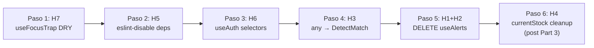

# Parte 4 — Plan de Ejecución: Hooks Reutilizables (`src/hooks/`)

Refactor quirúrgico de los hooks reutilizables. Elimina código muerto, corrige type safety, optimiza re-renders, y alinea con la limpieza de Part 3.

## Decisiones Resueltas

| Pregunta | Decisión |
|---|---|
| **H1 — ¿Eliminar `useAlerts.ts`?** | **ELIMINAR completamente** + eliminar `addAlert` del `alertStore`. Son un feature package muerto: polling + return — ambos sin consumidores. `AlertListPage.tsx` llena el store directamente vía `setActiveAlerts`. |
| **H4 — ¿Cast `as unknown as Product`?** | **Pasar `match` directamente** a `addToCart(match, 1)`. El cart solo usa `item.product.id`, `.name` y `.salePrice` — `MatchedProduct` tiene los 3. No se necesita cast ni tipo intermedio. |
| **H6 — ¿Selectores o useShallow?** | **Opción A: selectores individuales.** Más idiomático en Zustand, mejor tree-shaking, cada consumidor solo re-renderiza su slice. |

---

## Orden de Ejecución



> [!TIP]
> **Lógica del orden:** Triviales primero (H7, H5), luego optimización de render (H6), type safety (H3), eliminación de código muerto (H1+H2), y por último cleanup coordinado con Part 3 (H4).

---

## Paso 1 — H7: Extraer selector duplicado en `useFocusTrap`

### [MODIFY] [useFocusTrap.ts](file:///d:/Escritorio/trabajo/UCC/cuarto/FrontendVeltro/src/hooks/useFocusTrap.ts)

**Qué cambiar:**

1. **Agregar constante** antes de la declaración del hook (después de los imports, ~L2):
   ```typescript
   const FOCUSABLE_SELECTOR = 'button, [href], input, select, textarea, [tabindex]:not([tabindex="-1"])';
   ```

2. **Reemplazar** las 2 ocurrencias del selector string literal:
   - L27-28 (dentro de `handleKeyDown`):
     - **Antes:** `ref.current.querySelectorAll('button, [href], input, select, textarea, [tabindex]:not([tabindex="-1"])')`
     - **Después:** `ref.current.querySelectorAll(FOCUSABLE_SELECTOR)`
   - L59-60 (dentro del `useEffect`):
     - **Antes:** `ref.current.querySelectorAll('button, [href], input, select, textarea, [tabindex]:not([tabindex="-1"])')`
     - **Después:** `ref.current.querySelectorAll(FOCUSABLE_SELECTOR)`

**Impacto:** Trivial. DRY — single source of truth para el selector.

---

## Paso 2 — H5: Eliminar `eslint-disable` en `useAiScanQueue`

### [MODIFY] [useAiScanQueue.ts](file:///d:/Escritorio/trabajo/UCC/cuarto/FrontendVeltro/src/hooks/useAiScanQueue.ts)

**Qué cambiar en** L121-122:

**Antes:**
```typescript
  // eslint-disable-next-line react-hooks/exhaustive-deps
  }, [detections, aiEnabled]);
```

**Después:**
```typescript
  }, [detections, aiEnabled, setIsProcessing, updateStatus, updateMatches, videoRef]);
```

**Justificación:** Las 4 dependencias faltantes son **referencialmente estables**:
- `setIsProcessing`, `updateStatus`, `updateMatches` — funciones de Zustand store (estables entre renders)
- `videoRef` — `React.RefObject` (estable entre renders)

Agregarlas no cambia el comportamiento, pero elimina la supresión de lint.

**Impacto:** Trivial. Elimina lint suppression.

---

## Paso 3 — H6: Optimizar `useAuth` con selectores individuales

### [MODIFY] [useAuth.ts](file:///d:/Escritorio/trabajo/UCC/cuarto/FrontendVeltro/src/hooks/useAuth.ts)

**Qué cambiar en** L8-16:

**Antes:**
```typescript
export const useAuth = () => {
  const {
    user,
    accessToken,
    isAuthenticated,
    setAuth,
    logout: logoutStore,
    hasRole,
  } = useAuthStore();
```

**Después:**
```typescript
export const useAuth = () => {
  const user            = useAuthStore((s) => s.user);
  const accessToken     = useAuthStore((s) => s.accessToken);
  const isAuthenticated = useAuthStore((s) => s.isAuthenticated);
  const setAuth         = useAuthStore((s) => s.setAuth);
  const logoutStore     = useAuthStore((s) => s.logout);
  const hasRole         = useAuthStore((s) => s.hasRole);
```

**Beneficio:** Cada consumidor de `useAuth()` solo se re-renderiza cuando **su slice** cambia:
- `MainLayout` usa `user` + `logout` → no re-renderiza en token refresh
- `LandingPage` usa `isAuthenticated` → no re-renderiza en user update
- `HeaderSticky` usa `isAuthenticated` + `user` → no re-renderiza en token refresh

**Limpieza adicional:** Eliminar trailing blank lines al final del archivo (L52-55 → 3 líneas vacías extra).

**Impacto:** Bajo. Previene re-renders en cascada durante token refresh.

---

## Paso 4 — H3: Reemplazar `(p: any)` por `DetectMatch` en `useAiScanQueue`

### [MODIFY] [useAiScanQueue.ts](file:///d:/Escritorio/trabajo/UCC/cuarto/FrontendVeltro/src/hooks/useAiScanQueue.ts)

**4A — Agregar import de `DetectMatch`:**

En L12, agregar al import existente o crear nuevo:
```typescript
import type { DetectMatch } from '../api/pos';
```

**4B — Reemplazar mapeo** en L91-99:

**Antes:**
```typescript
if (data?.length && data[0].matches?.length) {
  const matches: MatchedProduct[] = data[0].matches.map((p: any) => ({
    id:           p.id,
    name:         p.name,
    sku:          p.sku ?? '',
    barcode:      p.barcode ?? '',
    salePrice:    p.salePrice?.toString() ?? '0',
    currentStock: undefined,
  }));
```

**Después:**
```typescript
if (data?.length && data[0].matches?.length) {
  const matches: MatchedProduct[] = data[0].matches.map((p: DetectMatch) => ({
    id:        p.id,
    name:      p.name,
    sku:       p.sku,       // null passthrough — MatchedProduct accepts string | null
    barcode:   p.barcode,   // null passthrough — MatchedProduct accepts string | null
    salePrice: p.salePrice, // already string in DetectMatch
  }));
```

**Cambios clave:**
- `(p: any)` → `(p: DetectMatch)` — type safety restaurada
- `p.sku ?? ''` → `p.sku` — null passthrough (después de Part 3 Paso 4B, `MatchedProduct.sku` es `string | null`)
- `p.barcode ?? ''` → `p.barcode` — null passthrough
- `p.salePrice?.toString() ?? '0'` → `p.salePrice` — ya es `string` en `DetectMatch`, no necesita conversión
- `currentStock: undefined` — **ELIMINADO** (post Part 3 Paso 4B, `MatchedProduct` ya no tiene `currentStock`)

> [!WARNING]
> **Dependencia:** La eliminación de `currentStock: undefined` y los cambios a `sku`/`barcode` null passthrough **requieren que Part 3 Paso 4B se haya ejecutado primero** (donde se corrigen los campos de `MatchedProduct`). Si Part 3 aún no se ejecutó, temporalmente mantener `sku: p.sku ?? ''` y `barcode: p.barcode ?? ''` y `currentStock: undefined`.

**Impacto:** Medio. Elimina `any`, alinea con tipos del API, elimina coerción innecesaria.

---

## Paso 5 — H1+H2: Eliminar `useAlerts.ts` + limpiar `addAlert` del store

> [!IMPORTANT]
> **Evidencia confirmada:**
> - `useAlerts` → 0 consumidores (grep verificado)
> - `addAlert` → 0 consumidores externos (solo store definición + hook destructuring)
> - `AlertListPage.tsx` llena el alertStore directamente via `setActiveAlerts` — no depende del hook

### [DELETE] [useAlerts.ts](file:///d:/Escritorio/trabajo/UCC/cuarto/FrontendVeltro/src/hooks/useAlerts.ts)

Eliminar el archivo completo (71 líneas). Esto elimina:
- La lógica de polling (`setInterval` cada 30s)
- La función `fetchAlerts` (que nunca se ejecuta)
- El return de `{ addAlert }` (sin consumidores)

### [MODIFY] [index.ts](file:///d:/Escritorio/trabajo/UCC/cuarto/FrontendVeltro/src/hooks/index.ts)

**Eliminar** L2: `export { useAlerts } from './useAlerts';`

**Estado final:**
```typescript
export { useAuth } from './useAuth';
export { useFocusTrap } from './useFocusTrap';
```

### [MODIFY] [alertStore.ts](file:///d:/Escritorio/trabajo/UCC/cuarto/FrontendVeltro/src/stores/alertStore.ts)

**Qué eliminar:**

1. **Interfaz `AlertStoreState`** — Eliminar L9:
   ```typescript
   addAlert: (alert: Alert) => void;
   ```

2. **Implementación** — Eliminar L29-44 (el método `addAlert` completo):
   ```typescript
   addAlert: (alert) => {
     set((state) => {
       const exists = state.activeAlerts.some((item) => item.id === alert.id);
       if (exists) {
         return {
           activeAlerts: state.activeAlerts.map((item) =>
             item.id === alert.id ? alert : item
           ),
         };
       }
       return {
         activeAlerts: [alert, ...state.activeAlerts],
       };
     });
   },
   ```

**Impacto:** Elimina ~87 líneas total (71 del hook + 16 del store). Limpieza completa del feature package muerto.

**Verificación:**
```powershell
# Confirmar que useAlerts no existe en el proyecto
rg "useAlerts" src/
# Debe devolver 0 resultados

# Confirmar que addAlert no existe fuera de las pruebas
rg "addAlert" src/ --glob '!**/test/**'
# Debe devolver 0 resultados
```

---

## Paso 6 — H4: Cleanup de `currentStock` + fix de tipo en cartStore (post Part 3)

> [!WARNING]
> **Este paso se ejecuta DESPUÉS de Part 3 H2 (eliminar `currentStock` de cartStore) y Part 3 Paso 4B (eliminar `currentStock` de `MatchedProduct`).**

### Verificación previa: ¿Qué usa el cart de `item.product`?

Grep confirmado — los consumidores del cart solo acceden a:
| Campo | Consumidor | Uso |
|---|---|---|
| `item.product.name` | `CartTable.tsx`, `ConfirmModal.tsx` | Display del nombre |
| `item.product.salePrice` | `CartTable.tsx`, `ConfirmModal.tsx`, `cartStore.getSubtotal/getTotal` | Cálculo de precio |
| `item.product.id` | `cartStore.add()` (via `product.id`) | Identificación del item |

**`MatchedProduct` tiene los 3 campos** (`id`, `name`, `salePrice`). No se necesita cast.

### 6A — Relajar la firma de `cartStore.add()` con `Pick<Product, ...>`

> [!IMPORTANT]
> **Problema de TypeScript:** Post Part 3, `cartStore.add()` acepta `Product`. Pero `MatchedProduct` tiene `{id, name, sku, barcode, salePrice}` — le faltan campos como `description`, `costPrice`, `categoryId`, `active`, `createdAt`, etc. TypeScript estructural **rechazará** `addToCart(match, 1)` porque `MatchedProduct` no satisface `Product`.
>
> **Solución:** Relajar la firma de `add()` para aceptar solo los campos que realmente usa.

#### [MODIFY] [cartStore.ts](file:///d:/Escritorio/trabajo/UCC/cuarto/FrontendVeltro/src/stores/cartStore.ts)

**6A-i — Definir tipo mínimo** (después de los imports, antes de `CartItem`):

```typescript
/** Minimum product shape accepted by the cart. Allows both full Product and MatchedProduct. */
export type CartProductInput = Pick<Product, 'id' | 'name' | 'salePrice' | 'barcode' | 'sku'>;
```

**6A-ii — Actualizar `CartItem`:**

**Antes (post Part 3):**
```typescript
export interface CartItem {
  productId: number;
  product: Product;
  quantity: number;
}
```

**Después:**
```typescript
export interface CartItem {
  productId: number;
  product: CartProductInput;
  quantity: number;
}
```

**6A-iii — Actualizar firma de `add()` en la interfaz `CartStore`:**

**Antes:**
```typescript
add: (product: Product, quantity: number) => void;
```

**Después:**
```typescript
add: (product: CartProductInput, quantity: number) => void;
```

> [!NOTE]
> Esto no rompe consumidores existentes: `Product` satisface `CartProductInput` (tiene todos esos campos), y `MatchedProduct` también lo satisface. Es un cambio que **amplía** la aceptación, no la restringe.

---

### 6B — Simplificar `AiScannerContainer.tsx`

#### [MODIFY] [AiScannerContainer.tsx](file:///d:/Escritorio/trabajo/UCC/cuarto/FrontendVeltro/src/components/pos/AiScannerContainer.tsx)

**Qué cambiar en** L62-71:

**Antes:**
```typescript
const match = det.matches[0];
console.log('[Cart] Auto-adding product:', match);

// Build a Product-compatible object.
// Force currentStock to undefined so the cart doesn't reject it on stock=0.
const productForCart = {
  ...match,
  currentStock: undefined,  // let cart ignore stock check
} as unknown as Product;

addToCart(productForCart, 1);
```

**Después:**
```typescript
const match = det.matches[0];
console.log('[Cart] Auto-adding product:', match);

addToCart(match, 1);
```

**Cambios:**
- Eliminado: El objeto intermedio `productForCart` con `currentStock: undefined`
- Eliminado: El cast `as unknown as Product`
- Simplificado: Pasa `match` directamente — `MatchedProduct` satisface `CartProductInput`

**Limpieza de import:** Eliminar el import de `Product` si ya no se usa en el archivo:
```typescript
import type { Product } from '../../types';  // L15 — eliminar si no hay otros usos
```

---

### 6C — Eliminar `currentStock: undefined` en `useAiScanQueue`

#### [MODIFY] [useAiScanQueue.ts](file:///d:/Escritorio/trabajo/UCC/cuarto/FrontendVeltro/src/hooks/useAiScanQueue.ts)

Si `currentStock: undefined` no fue eliminado en Paso 4 (porque Part 3 no se ejecutó aún), eliminarlo aquí:

**L98:** Eliminar `currentStock: undefined,`

---

## Resumen General del Plan

| Paso | Hallazgo | Archivos tocados | Líneas eliminadas | Riesgo |
|---|---|---|---|---|
| 1 | H7: useFocusTrap DRY | `useFocusTrap.ts` | 0 (refactor) | 🟢 Nulo |
| 2 | H5: eslint-disable deps | `useAiScanQueue.ts` | 1 (comment) | 🟢 Nulo |
| 3 | H6: useAuth selectors | `useAuth.ts` | ~3 (trailing) | 🟢 Nulo |
| 4 | H3: any → DetectMatch | `useAiScanQueue.ts` | ~3 | 🟡 Bajo |
| 5 | H1+H2: DELETE useAlerts | `useAlerts.ts` (DELETE), `index.ts`, `alertStore.ts` | ~87 | 🟢 Nulo |
| 6 | H4: currentStock + tipo | `cartStore.ts`, `AiScannerContainer.tsx`, `useAiScanQueue.ts` | ~7 (+tipo) | 🟡 Bajo |
| | **Total** | **7 archivos (1 eliminado)** | **~101 líneas** | |

---

## Decisiones Confirmadas

| # | Pregunta | Decisión |
|---|---|---|
| H1 | ¿Eliminar `useAlerts`? | **Eliminar.** 0 consumidores. `AlertListPage` usa el store directo. |
| H2 | ¿Eliminar `addAlert` del store? | **Eliminar.** 0 consumidores externos. Parte del feature package muerto. |
| H3 | ¿Cómo tipar el mapeo? | **Importar `DetectMatch` de `api/pos`.** El tipo ya existe. |
| H4 | ¿Cast o directo? | **Directo.** `addToCart(match, 1)` + relajar firma de `add()` con `Pick<Product, 'id' \| 'name' \| 'salePrice' \| 'barcode' \| 'sku'>`. |
| H6 | ¿Selectores o useShallow? | **Opción A: selectores individuales.** Más idiomático en Zustand. |

---

## Conexiones con Partes Anteriores

| Hallazgo Parte 4 | Conexión | Acción |
|---|---|---|
| H1 (useAlerts eliminado) | Part 3: addAlert sin consumidores | addAlert se elimina del store como parte de H1+H2 |
| H3 (any → DetectMatch) | Part 2: DetectMatch type en pos.ts | Usar tipo existente — no necesita creación |
| H4 (currentStock cleanup) | Part 3 H2 + Paso 4B | Ejecutar DESPUÉS de Part 3 |
| H6 (useAuth selectores) | Part 3 H5 (setTokens eliminado) | authStore ya está limpio, hook se alinea |

---

## Plan de Verificación

### Después de cada paso
```powershell
npm run build
```

### Después de Paso 5 (eliminación más grande)
```powershell
# Confirmar limpieza completa
rg "useAlerts" src/
rg "addAlert" src/ --glob "!**/test/**"
# Ambos deben devolver 0 resultados
```

### Después de Paso 4
```powershell
# Confirmar que no quedan any en hooks
rg ": any" src/hooks/
# Debe devolver 0 resultados
```

### Después de Paso 6 (post Part 3)
```powershell
# Confirmar que currentStock no aparece en hooks ni components
rg "currentStock" src/hooks/ src/components/
# Debe devolver 0 resultados
```

### Funcional
- Verificar que `useAuth` sigue funcionando en MainLayout (login/logout)
- Verificar que `useFocusTrap` sigue atrapando foco en ConfirmModal
- Verificar que `useAiScanQueue` sigue mapeando correctamente matches del backend
- Verificar que `AlertListPage` sigue llenando alertas sin `useAlerts` hook

> [!TIP]
> **Este plan tiene 0 preguntas abiertas**, 6 pasos de ejecución, y Paso 6 depende de Part 3.
