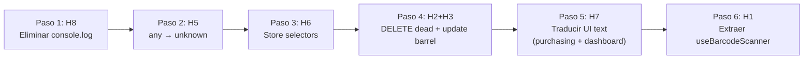

# Parte 5 — Análisis de Componentes Por Dominio (`src/components/`)

Análisis profundo de los 8 subdominios de componentes según los criterios de AGENTS_F.md.

## Inventario de Componentes

### 45 archivos | 8 subdominios | ~4,700 líneas totales

| Subdominio | Archivos | Líneas aprox. | Rol |
|---|---|---|---|
| `auth/` | AuthGuard, RoleGuard, index.ts | ~50 | Guards de ruta |
| `layout/` | MainLayout, index.ts | ~250 | Shell de la aplicación |
| `catalog/` | **ProductScanner** (604L), CategoryTree, index.ts | ~800 | Scanner + árbol de categorías |
| `pos/` | **ScannerContainer** (565L), AiScannerContainer, CartTable, ConfirmModal, DetectionOverlay, AiResultsPanel, AiIdentificationModal, ScanModeToggle, SaleReceipt, CameraErrorBoundary, index.ts | ~1,900 | Terminal POS completa |
| `inventory/` | AlertBadge, AlertList, AlertConfigForm, SeverityBadge, index.ts | ~350 | Sistema de alertas |
| `purchasing/` | **OrderList** (419L), **PurchaseOrderForm** (440L), SupplierSelect, ProductSearchSelect, ReceptionFlow, StateVisualizer, index.ts | ~900 | Órdenes de compra |
| `dashboard/` | ExportButtons, KPICard, LatestSalesTable, index.ts | ~300 | Panel principal |
| `audit/` | AuditDetailModal, AuditFilters, AuditTable, DiffViewer, index.ts | ~400 | Auditoría forense |

---

## Qué se Revisó (según AGENTS_F.md)

- ✅ Reutilización entre componentes
- ✅ Componentes con demasiada lógica
- ✅ División entre contenedores y presentacionales
- ✅ Props demasiado grandes o acoplamiento con API/store

---

## Hallazgos

---

### H1 — 🔴 Duplicación masiva: `ScannerContainer` ↔ `ProductScanner` (~200 líneas)

> [!IMPORTANT]
> **Este es el hallazgo más significativo de Parte 5.** Dos componentes de ~600 líneas comparten ~200 líneas de lógica idéntica.

**Archivos:**
- [ScannerContainer.tsx](file:///d:/Escritorio/trabajo/UCC/cuarto/FrontendVeltro/src/components/pos/ScannerContainer.tsx) (565 líneas) — POS barcode scanning
- [ProductScanner.tsx](file:///d:/Escritorio/trabajo/UCC/cuarto/FrontendVeltro/src/components/catalog/ProductScanner.tsx) (604 líneas) — Catalog product identification

**Código duplicado exacto:**

| Bloque | ScannerContainer | ProductScanner | Líneas |
|---|---|---|---|
| `CameraFeedbackState` type | L11-17 | L7-13 | 7 |
| `CAMERA_START_CONFIG` | L19 | L15 | 1 |
| `BARCODE_SCANNER_CONFIG` | L20-35 | L16-31 | 16 |
| Refs (scanner, lastScanned, isMounted, isStarting, isStopping, stopPromise, startToken, feedback, isHandling) | L60-70 | L73-82 | ~10 |
| `useEffect` isMounted lifecycle | L72-80 | L84-92 | 9 |
| `setTransientFeedback` callback | L82-96 | L94-108 | 15 |
| `stopScanner` callback (idéntico) | L138-181 | L161-204 | 44 |
| `startScanner` callback (casi idéntico) | L183-270 | L206-298 | ~60 |
| Camera feedback JSX block (ternarios) | L430-450 | L568-587 | 20 |
| `lastBarcode` reset useEffect | L290-295 | L341-346 | 6 |
| Error auto-dismiss useEffect | L325-330 | L349-354 | 6 |

**Total estimado: ~200 líneas duplicadas.**

**La diferencia clave entre ambos:**
- `ScannerContainer` añade al carrito vía `useCartStore` + tiene búsqueda por nombre (`handleSearchChange`)
- `ProductScanner` busca en DB para verificar existencia + tiene integración AI (`handleAiCapture`)

**Propuesta:** Extraer la lógica compartida de Html5Qrcode a un hook reutilizable `useBarcodeScanner`.

#### API del hook propuesto

```typescript
// hooks/useBarcodeScanner.ts (NEW — ~180 líneas)

export type CameraFeedbackState =
  | 'idle' | 'starting' | 'scanning'
  | 'product-added' | 'not-found' | 'camera-error';

interface UseBarcodesScannerOptions {
  /** DOM element ID for html5-qrcode (e.g. 'reader', 'catalog-reader') */
  readerId: string;
  /** Called when a barcode is successfully decoded */
  onDecode: (barcode: string) => Promise<void> | void;
  /** Set to false to pause the scanner (e.g. during AI loading) */
  enabled?: boolean;
}

export function useBarcodeScanner(options: UseBarcodesScannerOptions) {
  // Encapsulates:
  //   - CAMERA_START_CONFIG, BARCODE_SCANNER_CONFIG (constants)
  //   - All refs: scannerRef, lastScannedTimeRef, lastScannedCodeRef,
  //     isMountedRef, isStartingRef, isStoppingRef, stopPromiseRef,
  //     startTokenRef, feedbackTimerRef, isHandlingScanRef
  //   - useEffect: isMounted lifecycle
  //   - setTransientFeedback callback
  //   - stopScanner callback
  //   - startScanner callback (parameterized by readerId)
  //   - useEffect: start/stop based on enabled
  //   - useEffect: lastBarcode reset timer
  //   - useEffect: error auto-dismiss timer

  return {
    cameraReady,       // boolean
    cameraFeedback,    // CameraFeedbackState
    lastBarcode,       // string | null
    error,             // string | null
    startScanner,      // () => Promise<void>
    stopScanner,       // () => Promise<void>
    setTransientFeedback, // (state: CameraFeedbackState) => void
  };
}
```

#### Impacto por archivo

| Archivo | Líneas actuales | Líneas que se mueven al hook | Líneas restantes | Reducción |
|---|---|---|---|---|
| `ScannerContainer.tsx` | 565 | ~180 (refs, lifecycle, start/stop, feedback) | ~385 (search, cart, manual mode, JSX) | **-32%** |
| `ProductScanner.tsx` | 604 | ~180 (refs, lifecycle, start/stop, feedback) | ~424 (AI capture, suggestions, DB check, JSX) | **-30%** |
| `useBarcodeScanner.ts` (NEW) | — | — | ~180 | Nueva |
| **Neto** | **1,169** | | **~989** | **-180 líneas** |

#### [MODIFY] [hooks/index.ts](file:///d:/Escritorio/trabajo/UCC/cuarto/FrontendVeltro/src/hooks/index.ts)

Agregar export del nuevo hook al barrel:

```diff
 export { useAuth } from './useAuth';
 export { useFocusTrap } from './useFocusTrap';
+export { useBarcodeScanner } from './useBarcodeScanner';
```

> [!CAUTION]
> Sin este update, los componentes tendrían que importar directamente desde el archivo en lugar del barrel, rompiendo la convención del proyecto.

#### Riesgos

| Riesgo | Mitigación |
|---|---|
| Scanner es funcionalidad crítica del POS | Test funcional post-refactor: escanear barcode real |
| `startScanner` tiene diferencias menores (reader ID, stop-on-decode en Catalog) | Parametrizar via `readerId` y `options.stopOnDecode` |
| El JSX de feedback es duplicado pero no se puede mover al hook | Se mantiene en cada componente; el hook solo expone `cameraFeedback` para el ternario |

> [!WARNING]
> **Decisión necesaria:**
> - **Opción A:** Extraer `useBarcodeScanner` ahora — elimina ~180 líneas duplicadas, mejora mantenibilidad
> - **Opción B:** Marcar como deuda técnica — los scanners funcionan, la duplicación no causa bugs activos
>
> **Recomendación:** Opción A si hay tiempo. Si se prioriza velocidad, Opción B es aceptable.

---

### H2+H3 — `AiResultsPanel` y `AiIdentificationModal` tienen 0 consumidores (código muerto)

**Evidencia:**
```
Grep: from.*AiResultsPanel       → solo pos/index.ts (barrel export), 0 consumidores en pages/
Grep: from.*AiIdentificationModal → solo pos/index.ts (barrel export), 0 consumidores en pages/
```

- [AiResultsPanel.tsx](file:///d:/Escritorio/trabajo/UCC/cuarto/FrontendVeltro/src/components/pos/AiResultsPanel.tsx) (65 líneas) — funcionalidad ya integrada en `AiScannerContainer.tsx` (auto-add + toast). Contiene `as unknown as Product` (antipatrón Part 4 H4).
- [AiIdentificationModal.tsx](file:///d:/Escritorio/trabajo/UCC/cuarto/FrontendVeltro/src/components/pos/AiIdentificationModal.tsx) (218 líneas) — funcionalidad ya integrada en `ProductScanner.tsx` (`handleAiCapture` inline) y `AiScannerContainer.tsx` (YOLO pipeline).

**Propuesta — 3 sub-pasos:**

#### [DELETE] [AiResultsPanel.tsx](file:///d:/Escritorio/trabajo/UCC/cuarto/FrontendVeltro/src/components/pos/AiResultsPanel.tsx)
Eliminar archivo completo (65 líneas).

#### [DELETE] [AiIdentificationModal.tsx](file:///d:/Escritorio/trabajo/UCC/cuarto/FrontendVeltro/src/components/pos/AiIdentificationModal.tsx)
Eliminar archivo completo (218 líneas).

#### [MODIFY] [pos/index.ts](file:///d:/Escritorio/trabajo/UCC/cuarto/FrontendVeltro/src/components/pos/index.ts)

Eliminar las líneas del barrel que exportan los componentes eliminados:

```diff
 export { ScannerContainer } from './ScannerContainer';
 export { CartTable } from './CartTable';
 export { ConfirmModal } from './ConfirmModal';
 export { SaleReceipt } from './SaleReceipt';
-export { AiIdentificationModal } from './AiIdentificationModal';
 export { CameraErrorBoundary } from './CameraErrorBoundary';
 export { ScanModeToggle } from './ScanModeToggle';
-export { AiResultsPanel } from './AiResultsPanel';
 export { AiScannerContainer } from './AiScannerContainer';
```

> [!CAUTION]
> Si no se actualiza el barrel, `npm run build` fallará con import resolution errors.

> [!NOTE]
> H2 + H3 juntos eliminan **283 líneas** de código muerto + 2 líneas del barrel.

---

### H4 — `AiResultsPanel` usa `as unknown as Product` (tipo inseguro)

**Estado actual en** [AiResultsPanel.tsx:16](file:///d:/Escritorio/trabajo/UCC/cuarto/FrontendVeltro/src/components/pos/AiResultsPanel.tsx#L16):

```typescript
const handleAddToCart = (product: MatchedProduct) => {
  addToCart(product as unknown as Product, 1);
};
```

**Se resuelve automáticamente con H2** (eliminar el archivo).

---

### H5 — `ProductScanner` usa `catch (err: any)` (tipo inseguro)

**Estado actual en** [ProductScanner.tsx:134](file:///d:/Escritorio/trabajo/UCC/cuarto/FrontendVeltro/src/components/catalog/ProductScanner.tsx#L134):

```typescript
} catch (err: any) {
  if (err?.response?.status === 404 || err?.status === 404) {
```

**Propuesta:** Reemplazar `err: any` con manejo tipado:

```typescript
} catch (err: unknown) {
  const status = (err as { response?: { status?: number }; status?: number })?.response?.status
    ?? (err as { status?: number })?.status;
  if (status === 404) {
```

Este patrón ya se usa correctamente en `AiIdentificationModal.tsx:54` y `OrderList.tsx:33`.

---

### H6 — `CartTable` y `ConfirmModal` destructuran todo `useCartStore()` sin selectores

**CartTable.tsx L10-11:**
```typescript
const { items, remove, updateQty, getTotal, getSubtotal, getItemCount } =
  useCartStore();
```

**ConfirmModal.tsx L22:**
```typescript
const { items, getTotal } = useCartStore();
```

**Problema:** Mismo antipatrón de Part 4 H6. `useCartStore()` sin selector suscribe a **todo** el estado del store. Cualquier cambio en el store (incluyendo campos que el componente no usa) causa re-renders innecesarios.

**Propuesta:** Usar selectores individuales:

```typescript
// CartTable.tsx
const items = useCartStore((s) => s.items);
const remove = useCartStore((s) => s.remove);
const updateQty = useCartStore((s) => s.updateQty);
const getTotal = useCartStore((s) => s.getTotal);
const getSubtotal = useCartStore((s) => s.getSubtotal);
const getItemCount = useCartStore((s) => s.getItemCount);
```

**Impacto:** Bajo. Las funciones del store Zustand son estables, pero `items` cambia en cada add/remove — los selectores evitan re-renders cuando cambia un campo no relacionado.

---

### H7 — Texto de UI en inglés (violación del estándar)

**Estándar del proyecto:** Código interno en inglés, texto de UI (con el que interactúa el usuario) en español.

> [!IMPORTANT]
> **~25 strings de UI en inglés** distribuidas en 3 archivos, 2 dominios independientes. Los `aria-label` y `title` pueden permanecer en inglés (accesibilidad internacional).

#### H7-A — Dominio `purchasing/` (2 archivos, ~21 strings)

**[MODIFY] [OrderList.tsx](file:///d:/Escritorio/trabajo/UCC/cuarto/FrontendVeltro/src/components/purchasing/OrderList.tsx)** — 12 strings:

| Línea | Inglés | Español |
|---|---|---|
| L94 | "No purchase orders" | "No hay órdenes de compra" |
| L97 | "Create your first purchase order to get started" | "Crea tu primera orden de compra" |
| L148 | "Supplier:" | "Proveedor:" |
| L192 | "View Items" / "Hide Items" | "Ver Items" / "Ocultar Items" |
| L203 | "Receive" | "Recibir" |
| L211 | "Clone" | "Clonar" |
| L229 | "Void" | "Anular" |
| L249-274 | "Product", "Qty", "Unit Cost", "Received", "Subtotal" | "Producto", "Cant.", "Costo Unit.", "Recibido", "Subtotal" |
| L320 | "(pending)" | "(pendiente)" |
| L353 | "Are you sure you want to void this order?" | "¿Seguro que deseas anular esta orden?" |
| L373 | "Cancel" | "Cancelar" |
| L394 | "Confirm Void" | "Confirmar Anulación" |

**[MODIFY] [PurchaseOrderForm.tsx](file:///d:/Escritorio/trabajo/UCC/cuarto/FrontendVeltro/src/components/purchasing/PurchaseOrderForm.tsx)** — 9 strings:

| Línea | Inglés | Español |
|---|---|---|
| L178 | "Create Purchase Order" | "Crear Orden de Compra" |
| L246 | "Items" | "Artículos" |
| L259 | "Product" | "Producto" |
| L279 | "Quantity" | "Cantidad" |
| L310 | "Unit Cost" | "Costo Unitario" |
| L355 | "Remove Item" | "Eliminar Artículo" |
| L380 | "+ Add Item" | "+ Agregar Artículo" |
| L412 | "Purchase order created successfully!" | "¡Orden de compra creada exitosamente!" |
| L433 | "Creating..." / "Create Purchase Order" | "Creando..." / "Crear Orden de Compra" |

#### H7-B — Dominio `dashboard/` (1 archivo, 4 strings)

**[MODIFY] [ExportButtons.tsx](file:///d:/Escritorio/trabajo/UCC/cuarto/FrontendVeltro/src/components/dashboard/ExportButtons.tsx)** — 4 strings:

| Línea | Inglés | Español |
|---|---|---|
| L26 | "Failed to export PDF report" | "Error al exportar reporte PDF" |
| L46 | "Failed to export Excel report" | "Error al exportar reporte Excel" |
| L90 | "Exporting..." / "Export PDF" | "Exportando..." / "Exportar PDF" |
| L118 | "Exporting..." / "Export Excel" | "Exportando..." / "Exportar Excel" |

> [!NOTE]
> H7-A y H7-B son cambios independientes que se ejecutan juntos en un solo paso. Si alguno falla, el otro no se ve afectado.

---

### H8 — Console.log de debug en componentes de producción

**🗑️ Eliminar (debug sin valor en producción):**

| Archivo | Línea | Log | Razón |
|---|---|---|---|
| `ScannerContainer.tsx` | L215 | `console.log('[POS Scanner] frame procesado - decodedText:', ...)` | Debug de cada frame |
| `ScannerContainer.tsx` | L254 | `console.log('[POS Scanner] reader dimensions:', ...)` | Debug de layout |
| `ProductScanner.tsx` | L114 | `console.log('[Scanner] handleBarcodeScan llamado con:', ...)` | Debug de invocación |
| `ProductScanner.tsx` | L238-239 | `console.log('[Scanner] onSuccess llamado con:', ...)` + `console.log('[Scanner] Estado actual:', ...)` | Debug de estado interno |
| `ProductScanner.tsx` | L321 | `console.log('[Catalog Scanner] AI available:', ...)` | Debug de disponibilidad AI |

**✅ Mantener:**

| Archivo | Línea | Log | Razón |
|---|---|---|---|
| `AiScannerContainer.tsx` | L61 | `console.log('[Cart] Auto-adding product:', match)` | Utilidad de debug para cart — traza qué productos se agregan automáticamente |
| Cualquier `console.error` / `console.warn` | Varios | Errores y advertencias | Registran fallos reales |

**Total: eliminar 6 líneas de `console.log`, mantener 1.**

---

## Hallazgos Menores

| Observación | Archivo | Detalle |
|---|---|---|
| `ExportButtons` duplica lógica PDF/Excel | [ExportButtons.tsx](file:///d:/Escritorio/trabajo/UCC/cuarto/FrontendVeltro/src/components/dashboard/ExportButtons.tsx) | `handleExportPdf` y `handleExportExcel` son casi idénticos — podrían consolidarse en un helper |
| `ScannerContainer` usa selector para `addToCart` | [ScannerContainer.tsx:58](file:///d:/Escritorio/trabajo/UCC/cuarto/FrontendVeltro/src/components/pos/ScannerContainer.tsx#L58) | `useCartStore((state) => state.add)` — ✅ correcto, es el patrón a seguir |
| `AiScannerContainer` usa selector parcial para `useCartStore` | [AiScannerContainer.tsx:42](file:///d:/Escritorio/trabajo/UCC/cuarto/FrontendVeltro/src/components/pos/AiScannerContainer.tsx#L42) | `useCartStore()` destructure con `{ add: addToCart }` — pero es solo un campo, aceptable |
| `DetectionOverlay` tiene `eslint-disable` | [DetectionOverlay.tsx:99](file:///d:/Escritorio/trabajo/UCC/cuarto/FrontendVeltro/src/components/pos/DetectionOverlay.tsx#L99) | `canvasRef` omitido de deps — correcto, es stable ref. El comment explica bien. |
| `CameraErrorBoundary` usa inline styles | [CameraErrorBoundary.tsx:31-61](file:///d:/Escritorio/trabajo/UCC/cuarto/FrontendVeltro/src/components/pos/CameraErrorBoundary.tsx#L31-L61) | Aceptable — es un Error Boundary que debe renderizar sin CSS framework |
| `ProductScanner` indentación inconsistente | [ProductScanner.tsx:307](file:///d:/Escritorio/trabajo/UCC/cuarto/FrontendVeltro/src/components/catalog/ProductScanner.tsx#L307) | `const t = setTimeout(...)` tiene indentación incorrecta (no está alineado con el bloque) |
| `auth/` guards son limpios y bien estructurados | AuthGuard + RoleGuard | Presentacionales puros, sin lógica pesada, selectores correctos |
| `SeverityBadge` es un buen presentacional | [SeverityBadge.tsx](file:///d:/Escritorio/trabajo/UCC/cuarto/FrontendVeltro/src/components/inventory/SeverityBadge.tsx) | Props → render, sin side effects, sin store — patrón ideal |

---

## Resumen de Propuestas

| # | Hallazgo | Prioridad | Esfuerzo | Dependencia |
|---|---|---|---|---|
| 1 | Duplicación ScannerContainer ↔ ProductScanner | 🔴 Alta | Alto | Ninguna |
| 2 | AiResultsPanel 0 consumidores (DELETE) | 🔴 Alta | Trivial | Ninguna |
| 3 | AiIdentificationModal 0 consumidores (DELETE) | 🔴 Alta | Trivial | Ninguna |
| 4 | AiResultsPanel `as unknown as Product` | ✅ Resuelto | — | Se resuelve con H2 |
| 5 | ProductScanner `catch (err: any)` | 🟡 Media | Trivial | Ninguna |
| 6 | CartTable/ConfirmModal sin selectores | 🟡 Media | Bajo | Ninguna |
| 7 | UI text en inglés (purchasing + dashboard) | 🟡 Media | Bajo | Ninguna |
| 8 | Console.log de debug | 🟢 Baja | Trivial | Ninguna |

---

## Decisiones Confirmadas

| # | Pregunta | Decisión |
|---|---|---|
| H1 | ¿Extraer `useBarcodeScanner`? | **Opción A: Extraer ahora.** Crear `hooks/useBarcodeScanner.ts` (~180L), reducir `ScannerContainer` a ~385L y `ProductScanner` a ~424L. |
| H2+H3 | ¿Eliminar `AiResultsPanel` + `AiIdentificationModal`? | **Opción A: DELETE + actualizar barrel.** 0 consumidores, 285L muertas. |
| H7 | ¿Traducir ~25 strings UI inglés → español? | **Opción A: Traducir todo ahora.** purchasing/ (21 strings) + dashboard/ (4 strings). |

---

## Orden de Ejecución Recomendado



| Paso | Hallazgo | Archivos tocados | Líneas | Riesgo | Verificación |
|---|---|---|---|---|---|
| 1 | H8: console.log cleanup | `ScannerContainer.tsx`, `ProductScanner.tsx` | -6 | 🟢 Nulo | `rg "console\.log" src/components/` → solo `[Cart]` |
| 2 | H5: `err: any` → `unknown` | `ProductScanner.tsx` | ~3 | 🟢 Nulo | `rg "err: any" src/components/` → 0 |
| 3 | H6: Store selectors | `CartTable.tsx`, `ConfirmModal.tsx` | ~6 | 🟢 Nulo | `npm run build` |
| 4 | H2+H3: DELETE + barrel | `AiResultsPanel.tsx` (DEL), `AiIdentificationModal.tsx` (DEL), `pos/index.ts` | -285 | 🟢 Nulo | `rg "AiResultsPanel\|AiIdentificationModal" src/` → 0 |
| 5 | H7: UI text español | `OrderList.tsx`, `PurchaseOrderForm.tsx`, `ExportButtons.tsx` | ~25 strings | 🟢 Nulo | `npm run build` |
| 6 | H1: useBarcodeScanner | `ScannerContainer.tsx`, `ProductScanner.tsx`, `useBarcodeScanner.ts` (NEW) | -180 neto | 🟡 Medio | `npm run build` + test funcional ambos scanners |

> [!TIP]
> - **Pasos 1-3:** Triviales, bajo riesgo — limpieza quirúrgica
> - **Paso 4:** Elimina ~285 líneas de código muerto (incluye barrel)
> - **Paso 5:** Puramente cosmético — UI text, 2 dominios independientes
> - **Paso 6:** El más complejo — `npm run build` obligatorio + verificación funcional de ambos scanners

---

## Plan de Verificación

### Build obligatorio
- `npm run build` después de **cada** paso

### Después de Paso 1 (H8)
```powershell
rg "console\.log" src/components/ --glob "!*test*"
# Debe devolver SOLO: AiScannerContainer.tsx L61 — '[Cart] Auto-adding product:'
```

### Después de Paso 2 (H5)
```powershell
rg "err: any" src/components/
# Debe devolver 0 resultados
```

### Después de Paso 4 (H2+H3)
```powershell
rg "AiResultsPanel" src/
rg "AiIdentificationModal" src/
# Ambos deben devolver 0 resultados
```

### Después de Paso 6 (H1)
```powershell
# Confirmar que el hook existe y se importa correctamente
rg "useBarcodeScanner" src/
# Debe aparecer en: hooks/useBarcodeScanner.ts, ScannerContainer.tsx, ProductScanner.tsx

# Confirmar que la lógica duplicada ya no existe
rg "BARCODE_SCANNER_CONFIG" src/
# Debe aparecer SOLO en hooks/useBarcodeScanner.ts

rg "stopPromiseRef" src/
# Debe aparecer SOLO en hooks/useBarcodeScanner.ts
```

### Funcional (post Paso 6)
- Verificar que el POS scanner sigue escaneando barcodes (`ScannerContainer`)
- Verificar que el catalog scanner sigue escaneando barcodes (`ProductScanner`)
- Verificar que el cart sigue actualizando correctamente (`CartTable`)
- Verificar que AI capture sigue funcionando en `ProductScanner`

> [!TIP]
> **Este plan tiene 0 preguntas abiertas**, 6 pasos de ejecución, y todas las decisiones están confirmadas como Opción A.
